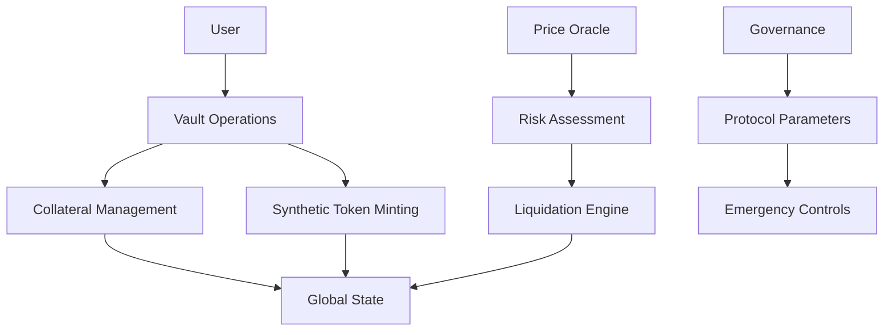

# SynthForge Protocol


[](https://clarity-lang.org/)
[](https://stacks.co/)

**Next-generation decentralized synthetic asset minting platform with adaptive risk management and algorithmic stability mechanisms**

## 🚀 Overview

SynthForge revolutionizes digital asset synthesis through an intelligent over-collateralized framework that transforms Bitcoin deposits into liquid synthetic tokens. The protocol employs sophisticated price discovery algorithms, autonomous liquidation engines, and dynamic collateral optimization to ensure robust peg stability.

### Key Features

- **🔒 Over-Collateralized Vaults**: Secure Bitcoin-backed synthetic asset generation
- **📊 Dynamic Risk Management**: Adaptive collateral ratios and liquidation mechanisms
- **⚡ Autonomous Liquidation**: Automated system for maintaining protocol health
- **🛡️ Emergency Controls**: Circuit breakers and governance mechanisms
- **💹 Real-time Analytics**: Comprehensive vault and protocol statistics
- **🔄 Composable Design**: Enhanced liquidity and DeFi ecosystem integration

## 🏗️ Architecture

### Core Components



### Protocol Constants

| Parameter | Value | Description |
|-----------|-------|-------------|
| **MIN_COLLATERAL_RATIO** | 120% | Minimum collateralization before liquidation |
| **MAX_COLLATERAL_RATIO** | 300% | Maximum allowed collateralization |
| **LIQUIDATION_PENALTY** | 10% | Penalty applied during liquidations |
| **STABILITY_FEE** | 0.5% | Annual stability fee for vault maintenance |
| **PRECISION** | 6 decimals | Mathematical precision for calculations |

## 📋 Smart Contract Interface

### Core Functions

#### Vault Management

```clarity
;; Create or expand vault and mint synthetic BTC
(define-public (mint-synthetic-btc 
    (collateral-amount uint) 
    (mint-amount uint))
```

```clarity
;; Burn synthetic BTC and withdraw collateral
(define-public (redeem-synthetic-btc 
    (burn-amount uint) 
    (withdraw-collateral uint))
```

#### Liquidation System

```clarity
;; Liquidate undercollateralized vaults
(define-public (liquidate-vault 
    (vault-owner principal) 
    (max-debt-to-clear uint))
```

#### Administrative Functions

```clarity
;; Update global collateral ratio
(define-public (update-collateral-ratio (new-ratio uint))

;; Emergency protocol shutdown
(define-public (emergency-shutdown-protocol)

;; Resume protocol operations
(define-public (resume-protocol)
```

### Read-Only Functions

#### Vault Information

```clarity
;; Get comprehensive vault details
(define-read-only (get-vault-info (vault-owner principal))

;; Check if vault is eligible for liquidation
(define-read-only (is-vault-liquidatable (vault-owner principal))

;; Calculate maximum mintable tokens
(define-read-only (calculate-max-mintable (collateral-amount uint))
```

#### Protocol Analytics

```clarity
;; Get global protocol statistics
(define-read-only (get-protocol-stats)

;; Retrieve liquidation event details
(define-read-only (get-liquidation-event (event-id uint))

;; Get current BTC price from oracle
(define-read-only (get-btc-price)
```

## 🛠️ Development Setup

### Prerequisites

- [Clarinet](https://github.com/hirosystems/clarinet) CLI tool
- [Node.js](https://nodejs.org/) (v16 or higher)
- [Stacks CLI](https://docs.stacks.co/docs/cli)

### Installation

1. **Clone the repository**

   ```bash
   git clone https://github.com/godwin-smart/synth-forge.git
   cd synth-forge
   ```

2. **Install dependencies**

   ```bash
   npm install
   ```

3. **Verify contract syntax**

   ```bash
   clarinet check
   ```

4. **Run tests**

   ```bash
   npm test
   ```

### Project Structure

```
synth-forge/
├── contracts/
│   └── synth-forge.clar          # Main protocol contract
├── tests/
│   └── synth-forge.test.ts       # Comprehensive test suite
├── settings/
│   ├── Devnet.toml              # Development network config
│   ├── Testnet.toml             # Testnet configuration
│   └── Mainnet.toml             # Mainnet settings
├── Clarinet.toml                # Project configuration
├── package.json                 # Dependencies and scripts
└── README.md                    # This file
```

## 🧪 Testing

The protocol includes a comprehensive test suite covering:

- **Vault Operations**: Minting, redemption, and collateral management
- **Liquidation Logic**: Undercollateralized vault handling
- **Edge Cases**: Boundary conditions and error scenarios
- **Governance**: Administrative function testing
- **Oracle Integration**: Price feed reliability

Run the test suite:

```bash
# Run all tests
npm test

# Check contract syntax
clarinet check

# Interactive REPL for testing
clarinet console
```

## 📊 Usage Examples

### Creating a Vault

```clarity
;; Deposit 1 BTC (100,000,000 satoshis) and mint 0.6 synthetic BTC
(contract-call? .synth-forge mint-synthetic-btc u100000000 u60000000)
```

### Checking Vault Status

```clarity
;; Get vault information for a user
(contract-call? .synth-forge get-vault-info 'SP1ABC123...)
```

### Liquidating a Vault

```clarity
;; Liquidate undercollateralized vault
(contract-call? .synth-forge liquidate-vault 'SP1VAULT... u50000000)
```

### Protocol Monitoring

```clarity
;; Get global protocol statistics
(contract-call? .synth-forge get-protocol-stats)
```

## ⚠️ Risk Management

### Liquidation Mechanism

Vaults are automatically liquidated when the collateralization ratio falls below 120%. The liquidation process:

1. **Eligibility Check**: Verify vault is undercollateralized
2. **Debt Clearing**: Liquidator burns synthetic tokens
3. **Collateral Seizure**: Transfer collateral + penalty to liquidator
4. **State Update**: Update vault and global protocol state

### Emergency Controls

The protocol includes several safety mechanisms:

- **Emergency Shutdown**: Halt all operations during critical issues
- **Circuit Breakers**: Automatic protection against extreme market conditions
- **Governance Controls**: Administrative functions for parameter adjustments

## 🔐 Security Considerations

### Audit Status

⚠️ **This contract has not been audited.** Do not use in production without proper security review.

### Known Limitations

- **Oracle Dependency**: Relies on external price feeds
- **Governance Centralization**: Single owner controls critical functions
- **MEV Exposure**: Potential for liquidation front-running

### Best Practices

- Always maintain collateralization above 150% for safety margin
- Monitor vault health regularly using analytics functions
- Be aware of market volatility impacts on collateral value

## 🏛️ Governance

### Administrative Functions

The protocol owner can:

- Update collateral ratio requirements (120%-300%)
- Trigger emergency shutdowns
- Resume protocol operations
- Update price oracle feeds

### Future Governance

Plans for decentralized governance include:

- **Token-based Voting**: Community governance tokens
- **Proposal System**: Democratic protocol upgrades
- **Timelock Mechanisms**: Delayed execution of critical changes

## 📈 Protocol Economics

### Fee Structure

- **Stability Fee**: 0.5% annual fee on outstanding debt
- **Liquidation Penalty**: 10% penalty on liquidated collateral
- **Protocol Revenue**: Accumulated from fees and penalties

### Token Mechanics

- **Synthetic BTC (vBTC)**: 1:1 peg with Bitcoin price
- **Collateral Requirements**: Minimum 120% overcollateralization
- **Supply Dynamics**: Elastic supply based on demand and collateral

## 🔗 Integration

### DeFi Ecosystem

SynthForge tokens are designed for:

- **DEX Trading**: Automated market maker integration
- **Lending Protocols**: Collateral for additional borrowing
- **Yield Farming**: Liquidity provision rewards
- **Cross-chain Bridges**: Multi-blockchain compatibility

### API Integration

```javascript
// Example integration with Stacks.js
import { callReadOnlyFunction } from '@stacks/transactions';

const vaultInfo = await callReadOnlyFunction({
  contractAddress: 'SP1...',
  contractName: 'synth-forge',
  functionName: 'get-vault-info',
  functionArgs: [principalCV(userAddress)],
  network: new StacksMainnet()
});
```

## 🚀 Deployment

### Testnet Deployment

```bash
# Deploy to Stacks testnet
clarinet deployments apply --deployment testnet
```

### Mainnet Preparation

Before mainnet deployment:

1. Complete comprehensive security audit
2. Implement decentralized governance
3. Establish oracle partnerships
4. Create emergency response procedures

## 📚 Resources

### Documentation

- [Clarity Language Reference](https://docs.stacks.co/docs/clarity)
- [Stacks Developer Guide](https://docs.stacks.co/docs/developer-guide)
- [Protocol Whitepaper](./docs/whitepaper.md) *(Coming Soon)*

### Community

- [Discord](https://discord.gg/synthforge) *(Coming Soon)*
- [Twitter](https://twitter.com/synthforge) *(Coming Soon)*
- [Forum](https://forum.synthforge.io) *(Coming Soon)*

## 🤝 Contributing

We welcome contributions! Please see our [Contributing Guide](./CONTRIBUTING.md) for details.

### Development Workflow

1. Fork the repository
2. Create a feature branch
3. Write tests for new functionality
4. Ensure all tests pass
5. Submit a pull request

## 📄 License

This project is licensed under the MIT License - see the [LICENSE](./LICENSE) file for details.
